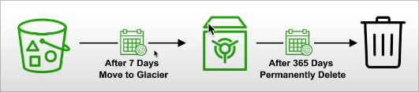

# Simple Storage Service (S3)

This is an **object based service**. 
Serverless storage in the cloud.

## Concepts

### Object-based storage
OBS is a data storage architecture that manages data as objects as opposed to other storage architectures such as **file systems** (manages data as a files and fire hierarchy) or **block storage** (manages data as blocks within sectors and tracks).

S3 provides **UNLIMITED STORAGE**.
We don't need to think about the underlying architecture => *serverless*
S3 console provides an interface to upload, access and manage the data.

### Objects
| Concept | Description |
| -- | -- |
| Key | Object name |
| Value | data itself (sequence of bytes) |
| Version ID | Object version |
| Metadata | Additionnal information attached to object |

We can store up to **5TB** of data per object.

### Buckets
Buckets hold objects and folders which hold objects.
S3 is a universal namespace so bucket names must be **UNIQUE**

## Storage Classes


### Storage Classes Comparison


S3 guarantees:
* Platform is built for 99.99% availability
* Amazon guarantees 99.9% availability
* Amazon guarantees 11' 9s of durability

## S3 Security

All new buckets are **private** by default.

Logging per request can be turned on a bucket.
Log files are generated and saved in a different bucket (even on a different AWS account if desired).
Access control is configured using **Bucket Policies** and **Access Control Lists (ACL)**.

### Bucket Policies
Use a policy to define complex rule access.

*For example:
```json
{
	"Version": "2020-08-09",
	"Statement": [
		{
			"Sid": "PublicReadGetObject",
			"Effect": "Allow",
			"Principal": "*",
			"Action": "s3:GetObject",
			"Resource": "arn:aws:s3:::www.exampro.co/*"
		}
	]
}
```

### Access Control Lists
More info [here](https://docs.aws.amazon.com/AmazonS3/latest/userguide/acl-overview.html)

Legacy feature (not deprecated) of controlling access to buckets and objects.
Simple way of granting access.

*Sample bucket ACL*
```XML
<?xml version="1.0" encoding="UTF-8"?>
<AccessControlPolicy xmlns="http://s3.amazonaws.com/doc/2006-03-01/">
  <Owner>
    <ID>*** Owner-Canonical-User-ID ***</ID>
    <DisplayName>owner-display-name</DisplayName>
  </Owner>
  <AccessControlList>
    <Grant>
      <Grantee xmlns:xsi="http://www.w3.org/2001/XMLSchema-instance" 
               xsi:type="Canonical User">
        <ID>*** Owner-Canonical-User-ID ***</ID>
        <DisplayName>display-name</DisplayName>
      </Grantee>
      <Permission>FULL_CONTROL</Permission>
    </Grant>
  </AccessControlList>
</AccessControlPolicy> 
```

#### Available Permissions
- READ
- WRITE
- READ_ACP (Allow grantee to read the buckt ACL)
- WRITE_ACP (Allow grantee to write the ACL for the applicable bucket)
- FULL_CONTROL (allow all)

## Encryption

### In Transit
Traffic between local host and S3 is achieved via SSL/TLS

### Server Side Encryption - At Rest
SSE-AES: S3 handles the key, uses AES-256 algorithm to encrypt
SSE-KMS (Key Management Service) Envelope encryption
SSE-C: Customer provided key

### Client Side
Can encrypt data on local before uploading.

## Data Consistency

### New Objects (PUTS)
**READ AFTER WRITE** Consistency
Able to **immediately read** data after writing

### Overwrite (PUTS) or Delete (DELETES) Objects
**EVENTUAL** consistency
When such an operation is made on an object it might take some time for S3 to replicate versions to AZs.
Need to generally wait a few seconds before reading.

## Cross Region Replication (CRR)

When enabled, any uploaded object will be **automatically replicated** to another(s) region(s).
This provides **higher durability** and potential **disaster recovery** for objects.
Must have **versioning** enabled on both source and destination buckets.
Can have CRR to another AWS account.

## Lifecycle Management

Allow to automate process of moving objects to different Storage classes or deleting all together.
Can be used with **versioning**.
Can be applied to both **current and previoous** versions.

*Example:*


## Transfer Acceleration

Fast and secure transfer of files **over long distances** between end-users and S3 bucket.
Use **CloudFront's** distributed **Edge Location**.
Instead of uploading to your bucket, users use a **distinct URL** for an Edge Location.

As Data arrives at the EL it's automatically routed to S3 over a specially optimized network path (Amazon's backbone network).


## Presigned URLs

Generate a URL which provides temporary access (either download or upload).
Presigned URLs are commonly used **to provide access to private objects** without making them public.
We can use AWS CLI or AWS SDK to generate those.

```shell
$ aws s3 presign s3://{{bucket_name}}/{{object_name}} --expires-in 300
'https://{{bucket_name}}.s3.amazonaws.com/{{object_name}}?AWSAccessKeyId=xxx&Expires={{timestamp}}&Signature=yyy'
```

## MFA Delete
Can anable MFA delete to ensure users cannot delete objects from a bucket unless they provide their MFA.

Conditions:
- Must use AWS CLI
- Versioning turned on

```shell
$ aws s3api put-bucket-versioning \
	--bucket {{bucket_name}}
	--versioning-configuration Status=Enabled,MFADelete=Enabled \
	--mfa "{{mfa_serial_number}} {{mfa_code}}"
```

## AWS CLI Cheat-sheet

```bash
# list all buckets
$ aws s3 ls 

# list all objects in bucket
$ aws s3 ls s3://{{bucket_name}} 
$ aws s3 ls s3://{{bucket_name}}/{{folder_name}}

# download object
$ aws s3 cp s3://{{bucket_name}}/{{object_name}} {{dest_file}}

# upload object
$ aws s3 cp {{origin_file}} s3://{{bucket_name}}/{{object_name}}

# presign urls
$ aws s3 presign s3://{{bucket_name}}/{{object_name}} --expires-in 300
```